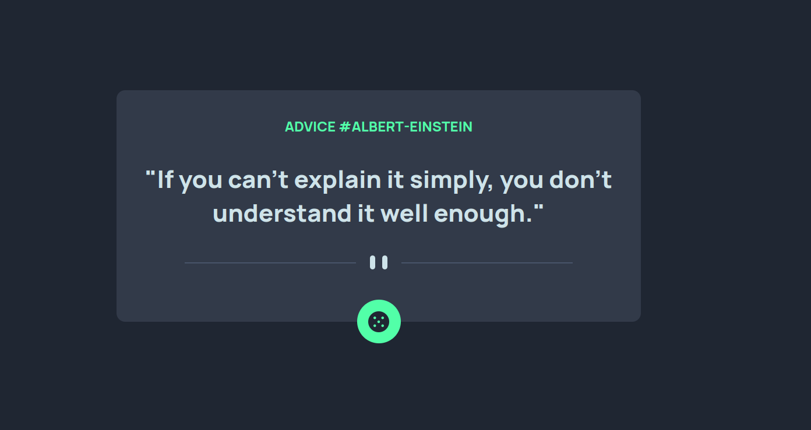
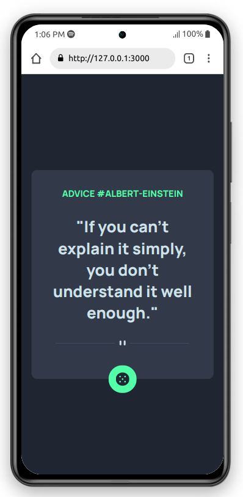

# Frontend Mentor - Advice generator app solution

This is a solution to the [Advice generator app challenge on Frontend Mentor](https://www.frontendmentor.io/challenges/advice-generator-app-QdUG-13db). Frontend Mentor challenges help you improve your coding skills by building realistic projects.

## Table of contents

- [The challenge](#the-challenge)
- [Screenshot](#screenshot)
- [Links](#links)
- [Built with](#built-with)
- [Author](#author)

### The challenge

Users should be able to:

- View the optimal layout for the app depending on their device's screen size
- See hover states for all interactive elements on the page
- Generate a new piece of advice by clicking the dice icon

### Screenshot

### Links

- Solution URL: [github](https://github.com/sanris12/advice-generator-app-main)
- Live Site URL: [github](https://sanris12.github.io/advice-generator-app-main)

### Built with

- HTML5
- CSS
- javascript
- API - https://github.com/lukePeavey/quotable

## Author

- Frontend Mentor - [@sanris12](https://www.frontendmentor.io/profile/sanris12)
